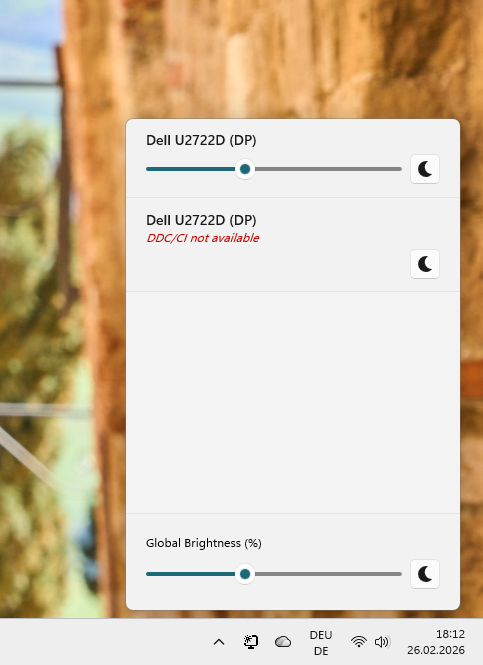
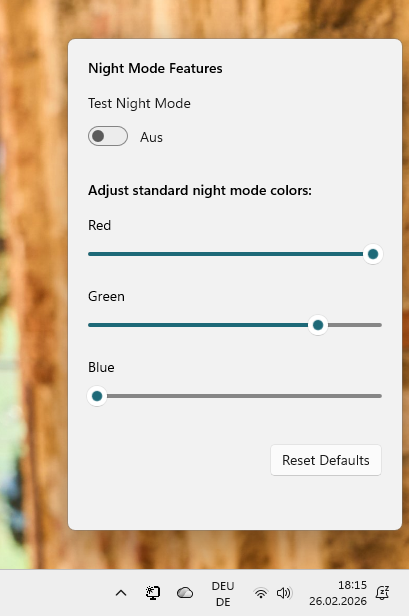

# DisplayBrightness

A modern, lightweight Windows utility built with WinUI 3 to control your monitor brightness directly from the system tray.

This tool gives you quick access to control hardware brightness for DDC/CI compatible external monitors, as well as a customizable Night Mode, all within a beautiful native Windows 11 interface.

## Features
 

- **System Tray Integration**: Quietly runs in the background. Access your monitor controls with a single click.
- **Hardware Brightness Control (DDC/CI & WMI/WMMI)**: Directly change the monitor's native brightness using DDC/CI for external displays and WMI (WMMI) for internal laptop displays.
- **Night Mode**: Easily tint your screen colors to reduce eye strain at night. Fully customizable RGB levels. 
- **Modern UI**: Uses WinUI 3, Desktop Acrylic backdrops, and Windows 11 rounded corners for a premium native look and feel.
- **Single Executable**: Ships as a lightweight, single portable executable (`.exe`).

## Installation

Go to the [Releases](https://github.com/mvodep/brightness-control/releases) page and download `DisplayBrightness.exe`.

The executable is built using .NET 10.0 and requires no additional installation steps. Just place it anywhere and run it!

## Usage

1. Open `DisplayBrightness.exe`.
2. A brightness icon will appear in your system tray on the taskbar.
3. **Left-click** the tray icon to open the main Brightness control panel.
4. **Right-click** the tray icon for options, or select **Night Mode** to configure custom night light RGB values.

## Building from Source

To build this project from source, you will need the following tools:

- [Visual Studio 2022](https://visualstudio.microsoft.com/) 
- [.NET 10.0 SDK](https://dotnet.microsoft.com/download)
- Windows App SDK workloads installed in Visual Studio.

1. Clone the repository.
2. Open `DisplayBrightness.csproj` / Solution in Visual Studio.
3. Build the project using `Release` configuration.

Alternatively, via the .NET CLI:
```bat
dotnet publish -c Release -r win-x64 --self-contained false -p:PublishSingleFile=true -p:IncludeNativeLibrariesForSelfExtract=true
```

## Automations

This repository incorporates a GitHub Action `release.yml` that automatically builds and deploys a single-file executable format whenever a new version tag (e.g., `v1.0.0`) is pushed to the repository.

## Dependencies

- **.NET 10.0-windows10.0.19041.0**
- **Microsoft.WindowsAppSDK** 
- **Microsoft.Windows.SDK.BuildTools**

## License

This project is licensed under the MIT License.
